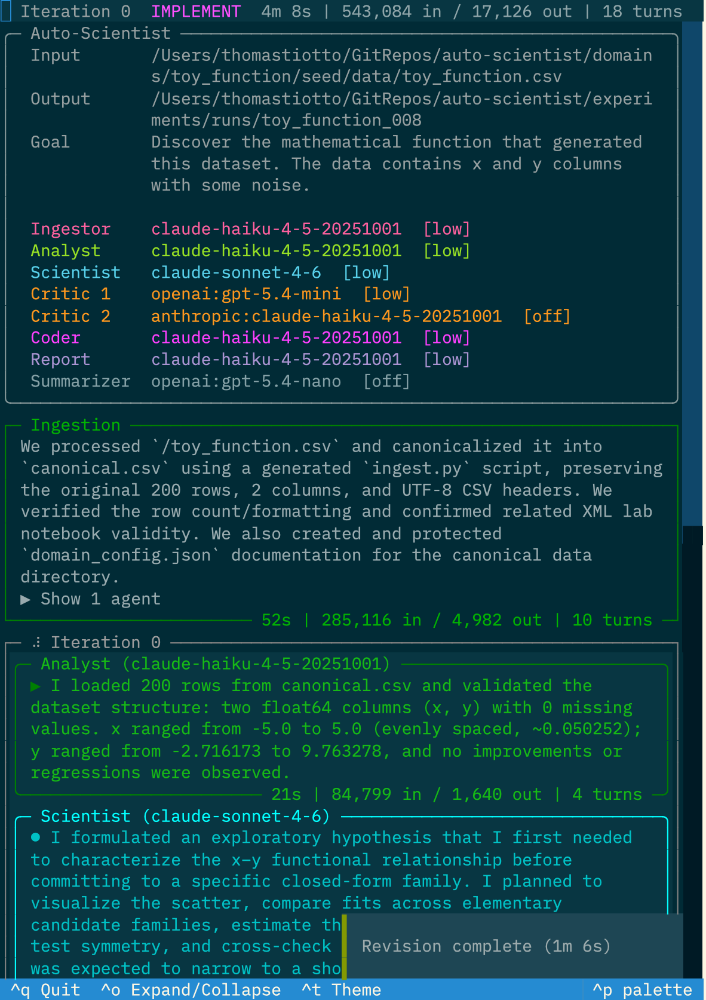
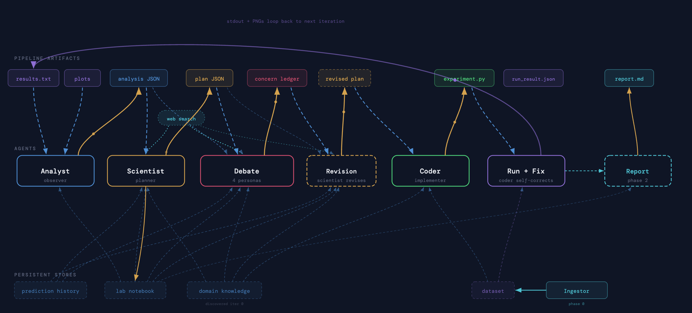
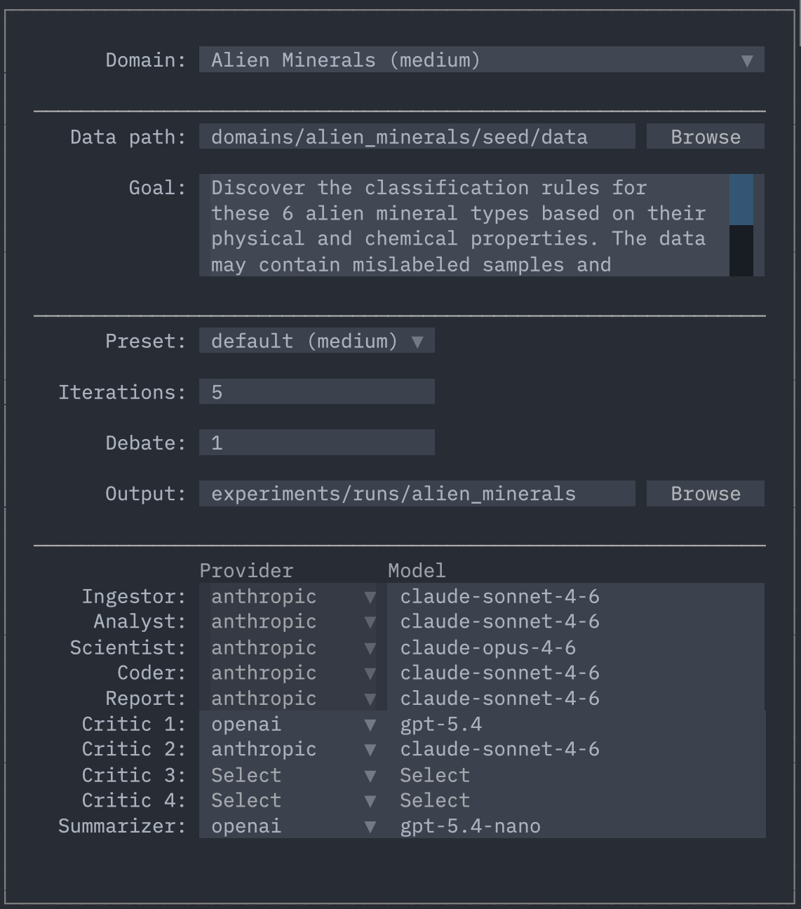

# Auto-Scientist

**An autonomous scientific investigation framework.** Give it a dataset and a question. It explores, hypothesizes, debates, implements, fails, recovers, and converges on an answer, without human intervention.



## How It Works

Four specialized agents run in a loop, each with strict information boundaries:

```
Ingest -> Analyst -> Scientist -> Debate -> Coder -> Run -> Evaluate -> loop
```

| Agent | Role | Key constraint |
|-------|------|----------------|
| **Analyst** | Observes results and plots, reports structured JSON | Cannot recommend, only observe |
| **Scientist** | Forms hypotheses, defines testable predictions, plans experiments | Never sees code |
| **Critics** | Challenge the plan from multiple angles (adversarial debate) | Never see code |
| **Coder** | Implements and runs experiments | Never sees the debate |

The Scientist never sees code. The Coder never sees the debate. The Analyst cannot recommend. These boundaries prevent confirmation bias: the entity that plans is not the one that evaluates, and the one that implements has no stake in the hypothesis.

Both Critics and Scientist have web search during debate to verify claims and look up literature.



### Adaptive iterations

- **Iteration 0**: Explore raw data, characterize distributions, establish baselines
- **Iteration 1**: Define top-level success criteria, formulate first hypothesis with testable predictions
- **Iteration 2+**: Full scientific loop with analysis, planning, critique, implementation, and evaluation

The Scientist decides when to stop based on scientific judgment (goal satisfied, noise floor reached, diminishing returns), not a fixed threshold.

### Prediction tracking

Every hypothesis comes with pre-registered testable predictions, each with diagnostics and branching plans ("if confirmed, do X; if refuted, do Y"). The experiment script evaluates them in code, and the Analyst transcribes outcomes. This creates accountability: wrong predictions redirect the investigation instead of being ignored.

## Quick Start

```bash
# Install
git clone https://github.com/thomast8/auto-scientist.git
cd auto-scientist
uv sync

# Set API keys (only needed for non-Anthropic critics)
export OPENAI_API_KEY="..."      # Optional (GPT as critic)
export GOOGLE_API_KEY="..."      # Optional (Gemini as critic)

# Launch the interactive TUI
auto-scientist

# Or run directly from a domain config
auto-scientist run -c domains/alien_minerals/experiment.yaml
```



## Built-in Domains

| Domain | Difficulty | What the system investigates |
|--------|------------|------------------------------|
| `toy_function` | Easy | Discover the hidden mathematical function from noisy x/y data |
| `alien_minerals` | Medium | Classify 6 alien mineral types from physical/chemical properties |
| `alloy_design` | Medium | Discover composition-property relationships in metal alloys |
| `water_treatment` | Hard | Causal discovery with latent confounders, feedback loops, nonlinearity, regime changes, and MNAR missingness |
| `spo2` | Expert | SpO2 dynamics during breath-holds (nonlinear physiology, latent variables, domain expertise) |

Each domain is a directory under `domains/` with an `experiment.yaml`, seed data, and optional domain-specific prompts. Adding a new domain means copying the template and filling in your data path and goal.

## Examples

### Toy Function Discovery (Easy)

Given 200 noisy (x, y) points and zero hints, the system recovered the exact generating formula in two iterations. Full writeup: [docs/showcase-toy-function.md](docs/showcase-toy-function.md).

It screened polynomials and trig composites, identified a phase ambiguity in the cosine fit, reparameterized to sine, proved the clean constants (0.3, 2.5, 1.5) are preferred over free parameters by BIC, and confirmed residual whiteness with Fisher's g-test. Critics caught test-set leakage and goal drift before they could corrupt the results.

| Metric | Value |
|--------|-------|
| Wall time | 39 minutes |
| Iterations | 2 |
| Discovered formula | y = 0.3x² + 2.5·sin(1.5x) |
| Parameter accuracy | within 1.5% |
| Test R² | 0.959 (ceiling: 0.978) |

### Alien Minerals Classification (Medium)

The system classified six alien mineral types from nine physical measurements, noisy labels, and calibration artifacts. Full writeup: [docs/showcase-alien-minerals.md](docs/showcase-alien-minerals.md).

It went down a dead end (a hand-crafted hierarchy that dropped F1 from 0.92 to 0.60), got called out by its own critics for sunk-cost reasoning, pivoted to validating the decision tree's own rules, and delivered interpretable classification rules in 58 minutes. No human touched the data or wrote any code.

| Metric | Value |
|--------|-------|
| Wall time | 58 minutes |
| Iterations | 3 |
| Final macro F1 | 0.93 (5x5 CV) |
| Unanimous specimens misclassified | 0 / 475 |
| Features in final rules | 5 of 12 |

### Alloy Composition-Property Relationships (Medium)

The system investigated what drives hardness in Fe-Cr-Ni-Mo-V alloys, navigating corrupt lab data, a synthetic corrosion column, and literature-contradicting results. Full writeup: [docs/showcase-alloy-design.md](docs/showcase-alloy-design.md).

It discovered that molybdenum is the dominant nonlinear hardness driver (101 HV/% below 6%, saturating to 7 HV/% above 12%), proved corrosion resistance was a synthetic score (R² = 0.84 from raw compositions), and killed a Cr threshold hypothesis after its critics called out sunk-cost reasoning. The debate forced three methodology corrections: CLR transforms for compositional data, ALE over PDP plots, and restricted cross-lab pooling.

| Metric | Value |
|--------|-------|
| Wall time | 80 minutes |
| Iterations | 4 |
| Nested CV R² | 0.80 |
| External validation R² | 0.70 |
| Testable predictions | 17 (47% confirmed, 47% refuted) |

### Water Treatment Causal Discovery (Hard)

The system discovered the causal structure of a water treatment plant from 2,200 hours of time-series data, resolving a Simpson's paradox where chemical dose appeared to harm the process it was meant to help. Full writeup: [docs/showcase-water-treatment.md](docs/showcase-water-treatment.md).

It proved that dose has zero direct effect on outlet clarity (fully mediated through floc formation), discovered operators respond to output quality rather than input turbidity, identified temperature as an uncompensated floc inhibitor, and assembled a complete 12-edge causal graph. The stop gate forced an extra iteration that produced the investigation's most operationally relevant finding.

| Metric | Value |
|--------|-------|
| Wall time | 106 minutes |
| Iterations | 4 |
| Variables placed | 10/10 |
| Testable predictions | 18 (44% confirmed, 44% refuted) |

### Backend Comparison: Anthropic vs OpenAI

Same toy function problem, same prompts, same critic panel, different LLM backends. The Anthropic backend (Opus 4.6 as scientist) found the exact generating formula in 5 iterations. The OpenAI backend (GPT-5.4 as scientist) ran for 12 iterations, settled on the wrong frequency, and concluded the problem was unsolvable. Full writeup: [docs/comparison-anthropic-vs-openai-toy-function.md](docs/comparison-anthropic-vs-openai-toy-function.md).

The core difference wasn't the critics (identical) or the prompts (identical); it was the scientist model's ability to commit to specific numerical hypotheses and select the right analytical tool at the right moment. The stronger scientist created a positive feedback loop with the debate structure, while the weaker one got trapped in stop-withdraw cycles that wasted 7 iterations.

| | Anthropic (Opus 4.6) | OpenAI (GPT-5.4) |
|---|---|---|
| Iterations | 5 | 12 |
| Final RMSE | **0.440** (noise floor) | 1.190 |
| Frequency identified | 1.500 (correct) | 1.571 (wrong) |
| Stop proposals | 1 (maintained) | 5 (4 withdrawn) |
| Conclusion | Exact recovery | "Not uniquely recoverable" |

## Usage

### TUI Launcher

Run bare to open an interactive form:

```bash
auto-scientist
```

Pre-fill from a domain config:

```bash
auto-scientist -c domains/alien_minerals/experiment.yaml
```

Keyboard shortcuts: `Ctrl+R` run, `Ctrl+S` save config, `Ctrl+Q` quit.

### Direct CLI

```bash
# From YAML config
auto-scientist run -c domains/spo2/experiment.yaml

# From raw data
auto-scientist run \
  --data ./my_data.csv \
  --goal "Investigate the relationship between X and Y" \
  --max-iterations 10

# Override settings
auto-scientist run -c domains/spo2/experiment.yaml --max-iterations 5 --preset fast

# Schedule for overnight
auto-scientist run -c domains/spo2/experiment.yaml --schedule "22:00-06:00"
```

### Resume and Status

State is persisted after every phase transition. Kill and resume without data loss.

```bash
# Resume a crashed or paused run from where it left off
auto-scientist resume --from experiments/runs/my-run

# Resume with a different model config
auto-scientist resume --from experiments/runs/my-run --preset high

# Fork: copy to new directory, resume from a specific iteration (original untouched)
auto-scientist resume --from experiments/runs/my-run --fork --from-iteration 3

# Fork and resume from a specific agent within that iteration
auto-scientist resume --from experiments/runs/my-run --fork --from-iteration 3 --from-agent scientist

# Fork without --from-iteration: continue from where it stopped with more iterations
auto-scientist resume --from experiments/runs/my-run --fork --max-iterations 20

# View a completed run in the TUI (read-only)
auto-scientist show --from experiments/runs/my-run

# Check progress of any run (text summary)
auto-scientist status --from experiments/runs/my-run
```

Without `--fork`, resume picks up in-place from the last saved phase. With `--fork`, it copies the run to a new directory (original untouched). Add `--from-iteration N` to rewind to iteration N in the copy (keeps iterations 0 through N-1). Add `--from-agent` to resume from a specific agent within an iteration (earlier agents' artifacts are loaded from disk and shown with dashed borders in the TUI).

## Configuration

### YAML Experiment Config

```yaml
data: seed/data/my_data.csv
goal: >
  Describe the investigation goal here.

# Optional
max_iterations: 20
preset: default          # default, fast, high, max
schedule: "22:00-06:00"  # Time window for execution
interactive: false       # Human-in-the-loop at decision points

# Per-agent model overrides
models:
  scientist:
    provider: anthropic
    model: claude-opus-4-6
    reasoning: high
  critics:
    - provider: openai
      model: gpt-5.4
      reasoning: medium
    - provider: google
      model: gemini-3.1-pro-preview
      reasoning: high
```

### Model Presets

| Preset | Use case | Scientist | Critics |
|--------|----------|-----------|---------|
| `default` | Balanced | opus-4-6 (medium reasoning) | Gemini 3.1 Pro + GPT-5.4 |
| `fast` | Speed/cost | haiku-4-5 | Gemini Flash Lite + GPT-5.4-nano |
| `high` | Quality | opus-4-6 (high reasoning) | Gemini 3.1 Pro + GPT-5.4 (high) |
| `max` | Maximum | opus-4-6 (max reasoning) | Gemini 3.1 Pro + GPT-5.4 (max) |

All core agents run through either the [Claude Code SDK](https://docs.anthropic.com/en/docs/claude-code) (Anthropic, default) or [Codex CLI](https://github.com/openai/codex) (OpenAI), using your subscription instead of per-token API billing. Use `--provider openai` to switch to the Codex backend. Critics support mixed providers (OpenAI, Google) via direct API calls, which require their respective API keys and are billed per-token.

## CLI Reference

### `auto-scientist run`

| Flag | Default | Description |
|------|---------|-------------|
| `--data <path>` | *(required without YAML)* | Path to dataset |
| `--goal <text>` | *(required without YAML)* | Investigation goal |
| `-c, --config <path>` | | YAML config file |
| `--preset <name>` | `default` | Model preset |
| `-p, --provider <name>` | `anthropic` | SDK backend: `anthropic` or `openai` |
| `--max-iterations <int>` | `20` | Maximum iterations |
| `--output-dir <path>` | `experiments` | Output directory |
| `--schedule <window>` | | Time window, e.g. `"22:00-06:00"` |
| `--interactive` | `false` | Human-in-the-loop mode |
| `--no-summaries` | | Disable agent progress summaries |
| `-v, --verbose` | | Debug logging |

### `auto-scientist resume`

Resume a paused, crashed, or completed run. By default resumes in-place. With `--fork`, copies to a new directory first.

| Flag | Default | Description |
|------|---------|-------------|
| `--from <path>` | *(required)* | Path to run directory (or `state.json`) |
| `--fork` | | Copy to new directory before resuming (original untouched) |
| `--from-iteration <int>` | *(current)* | Resume from this iteration (keeps all prior). Alias: `--resume-from`. Requires `--fork` |
| `--from-agent <name>` | | Resume from this agent (`analyst`, `scientist`, `debate`, `coder`) within the target iteration. Requires `--fork` |
| `--output-dir <path>` | *(auto)* | Output directory for fork (default: auto-generated). Requires `--fork` |
| `--max-iterations <int>` | `20` | Maximum iteration count |
| `-c, --config <path>` | | Override model config |
| `--preset <name>` | | Override preset |
| `-p, --provider <name>` | | Override SDK backend: `anthropic` or `openai` |
| `--no-summaries` | | Disable agent progress summaries |
| `-v, --verbose` | | Debug logging |

### `auto-scientist show`

Display a completed run in the interactive TUI (read-only). All iteration panels are expandable/collapsible.

| Flag | Description |
|------|-------------|
| `--from <path>` | *(required)* Path to run directory (or `state.json`) |

### `auto-scientist status`

| Flag | Description |
|------|-------------|
| `--from <path>` | *(required)* Path to run directory (or `state.json`) |

## Output Structure

```
experiments/
  state.json              # Full state (for resume)
  lab_notebook.xml         # Iteration journal
  report.md                # Final report
  data/                    # Canonicalized data
  buffers/                 # Raw agent output per phase
  v00/                     # Per-iteration outputs
    experiment.py          #   Generated experiment script
    plan.json              #   Scientist's plan
    analysis.json          #   Analyst's structured observation
    results.txt            #   Script output
    *.png                  #   Generated plots
```

## Adding a New Domain

1. Copy `domains/example_template/` to `domains/your_domain/`
2. Place your data in `domains/your_domain/seed/data/`
3. Create `experiment.yaml` with your data path and goal
4. Optionally add domain-specific prompts in `prompts.py`

## Development

```bash
uv sync --group dev
uv run pytest
uv run ruff check src/ tests/
```

## Requirements

- Python >= 3.12
- [uv](https://docs.astral.sh/uv/)
- [Claude Code CLI](https://docs.anthropic.com/en/docs/claude-code) (`npm install -g @anthropic-ai/claude-code`) for Anthropic backend
- [Codex CLI](https://github.com/openai/codex) (`npm install -g @openai/codex`) for OpenAI backend (optional)
- API keys: `OPENAI_API_KEY` (for OpenAI critics or Codex backend), `GOOGLE_API_KEY` (optional, for Google critics)

## Architecture

See [docs/architecture.md](docs/architecture.md) for the full spec, or open [docs/pipeline-visualizer.html](docs/pipeline-visualizer.html) for an interactive diagram.

## Status

**Stable** (v1.0.0). The core pipeline works end-to-end with full autonomous investigation capabilities.
